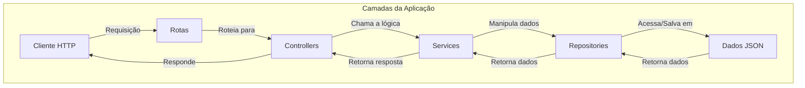

# API de Jogadores e Clubes da Champions League

Este projeto é uma API RESTful desenvolvida com Node.js e TypeScript, que simula um sistema de gerenciamento de jogadores e clubes de futebol, com foco na Champions League. A API utiliza arquivos JSON como base de dados, seguindo uma arquitetura em camadas para separar as responsabilidades de forma clara e escalável.

## 🚀 Funcionalidades

A API oferece os seguintes endpoints para manipulação dos dados:

### Jogadores
- `GET /api/players`: Lista todos os jogadores.
- `POST /api/players`: Cria um novo jogador.
- `GET /api/players/:id`: Busca um jogador pelo ID.
- `PATCH /api/players/:id`: Atualiza as estatísticas de um jogador.
- `DELETE /api/players/:id`: Exclui um jogador pelo ID.

### Clubes
- `GET /api/clubs`: Lista todos os clubes.
- `POST /api/clubs`: Cria um novo clube.
- `GET /api/clubs/:id`: Busca um clube pelo ID.
- `DELETE /api/clubs/:id`: Exclui um clube pelo ID.

## 🛠️ Tecnologias Utilizadas

- **[Node.js](https://nodejs.org/)**: Ambiente de execução JavaScript.
- **[Express](https://expressjs.com/)**: Framework para construção de APIs.
- **[TypeScript](https://www.typescriptlang.org/)**: Superset do JavaScript que adiciona tipagem estática.
- **[tsup](https://tsup.js.org/)**: Ferramenta para empacotamento (bundling) do TypeScript.
- **[tsx](https://github.com/esbuild/tsx)**: Ferramenta para executar TypeScript diretamente.

## ⚙️ Instalação e Execução

Para rodar o projeto localmente, siga os passos abaixo:

1.  Clone este repositório:
    ```bash
    git clone https://github.com/GilianoGN/ChampionLeagues-API.git
    cd ChampionLeagues-API
    ```

2.  Instale as dependências:
    ```bash
    npm install
    ```

3.  Execute o projeto em modo de desenvolvimento (com *hot-reloading*):
    ```bash
    npm run start:watch
    ```
    O servidor será iniciado e estará disponível em `http://localhost:3000`.

## 🏛️ Arquitetura do Projeto

O projeto segue uma arquitetura em camadas, separando a lógica de negócio da manipulação de dados e da interface da API.

-   **`controllers/`**: Responsável por receber as requisições HTTP, chamar a camada de `service` e enviar as respostas.
-   **`services/`**: Contém a lógica de negócio do aplicativo.
-   **`repositories/`**: Abstrai a camada de acesso a dados, fazendo a leitura e escrita nos arquivos JSON.
-   **`models/`**: Define as interfaces (tipos de dados) utilizadas no projeto.

### Organograma da Arquitetura (Mermaid)


Visualização da Arquitetura Geral

### 📄 Licença
Este projeto está sob a licença ISC. Para mais detalhes, veja o arquivo LICENSE na raiz do projeto.